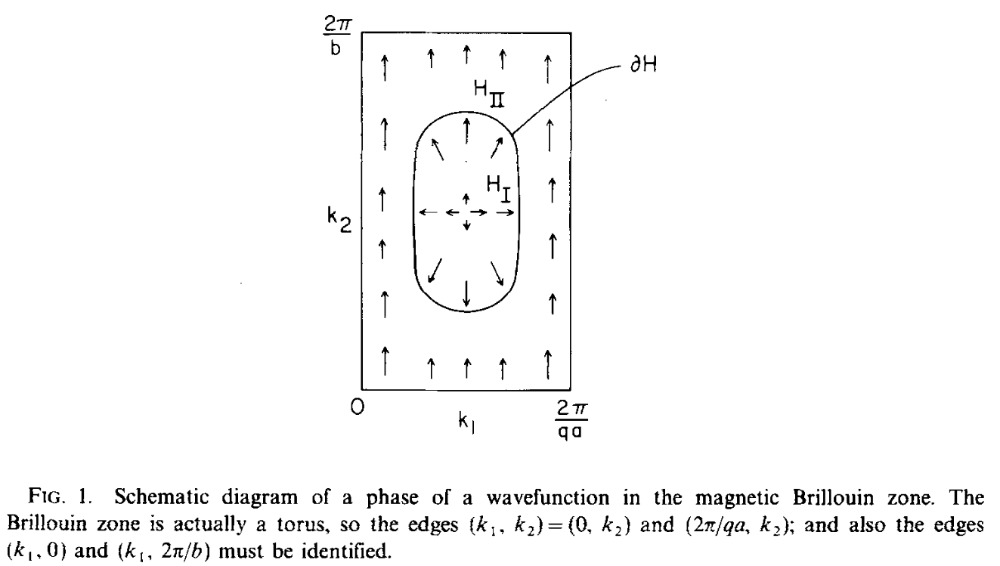



# Topological invariant of the Hall conductance

## Abstract

For the two dimensional periodic potential with magnetic field, the
quantized value of the Hall conductance \\(\sigma\_{xy}\\) is related to the
number of the zeros of the wavefunction in the magnetic Brillouin zone.

## Bloch electrons in the uniform magnetic filed

Consider the Shrodiger equation in 2D non-interacting electron system in a
uniform magnetic perpendicular to the plane.(The potential \\(U(x,y)\\) is
periodic in both x- and y- direction.)

### The gauge potential in this system

Notice that the Hamiltonian is not invariant under the translation
invariant even though the potential \\( U(x,y) \\) has this symmetry. The reason
is that the **gauge potential** \\(A\\) is not constant as fucntion of the
space in spite of the fact that the magnetic field is uniform.

Consider the Bravais lattice for this system, \\(R = n \vec{a} + m \vec{b}\\),
where $$n$$ and $$m$$ are integers.

#### Translation operator

Define the translation operator $$T_R$$ which is:

$$
T_R f(\mathbf{r}) = f(\mathbf{r+R})
$$

After this transformation, the potential left invariant, but the gauge
potential is transformed to $$ \mathbf{A(r+R)}$$ which is not equal to
$$\mathbf{A}$$ which is differ by a scalar fucntion.

$$
\mathbf{A(r)} = \mathbf{A(r+R)} + \nabla g(\mathbf{r})
$$

Therefore, we can consider the magnetic translation operator

$$
\hat{T}_R = \exp {(i/h)\mathbf{R}\cdot [\mathbf{p} + e(\mathbf{r} \times
\mathbf{B})/2]}
$$

If symmetry gaufe $$\mathbf{A} = (\mathbf{B} \times \mathbf{r})/2$$ is taken.
which can leaves Hamiltonian invariant.

Notes that magnetic operator do not commute with each other in general
since:

$$
\hat{T}_a \hat{T}_b = \exp(2\pi i \phi) \hat{T}_b\hat{T}_a
$$

where $$\phi = (eB/h)ab$$ is number of magnetic flux in the unit cell.

#### Eigenfunction of Hamiltonian and magnetic translation operator

Eigen-equation of translation operator:

$$
\hat{T}_qa \psi = e^{ik_1qa} \psi
$$

$$
\hat{T}_b \psi = e^{ik_2b} \psi
$$

Where $$k_1$$ and $$k_2$$ are generalized crystal momenta and can be restricted
in the magnetic Brillouin zone :$$0 \leq k_1 \leq 2\pi/qa$$,
$$0 \leq k_2 \leq 2 \pi/b$$.

The Bloch form of the wavefunction would be:

$$
\psi^{(\alpha)}_{k_1k_2}(x,y) = e^{ik_1x+ik_2y} u^{(\alpha)}_{k_1k_2}(x,y)
$$

It has the property that:

$$
u^{(\alpha)}_{k_1k_2}(x+qa, y) = e^{-i\pi py/b}u^{(\alpha)}_{k_1k_2}(x,y)
$$

$$
u^{(\alpha)}_{k_1k_2}(x,y+b) = e^{i\pi px/qa}u^{(\alpha)}_{k_1k_2}(x,y)
$$

These are the generalized Bloch condition.

Note that a gauge transformation $$\mathbf{A'} = \mathbf{A} + \nabla f$$
change the phase of a wavefunction, $$\psi'= e^{-ie/hf}\psi$$. A gauge
invariant is the phase change around the boundary of the magnetic unit
cell.

Wavefunction would be:

$$
u_{k_1k_2}(x,y) = \vert u_{k_1k_2}(x,y) \vert \exp[i\theta_{k_1k_2}(x,y)]
$$

one has

$$
p = \frac{-1}{2 \pi} \int d\mathbf{l} \cdot \frac{\partial
\theta_{k_1k_2}(x,y)}{d\mathbf{l}}
$$

Where it integral around the boundary of the magnetic unit cell.It shows
that is gauge-invariant although $$\theta_{k_1k_2}(x,y)$$ denpends on gauge.
If we go around clockwise with a small circle which contains the zero, **the
corresponding arrow rotates once either clockwise or counterclockwise** which
means that can regard a zero of wavefunction as vortex which has a
vorticity either 1 or -1(This is a topological constraint because the
vorticity in the magnetic unit cell is independent of a particular
potential chosen).

## Linear Response Formula for the Hall Conductance

For the Schrodinger euqation with periodical potential, the Hall conductance can
expressed as:

$$
\sigma^{(\alpha)}_{xy} = \frac{e^2}{h} \frac{1}{2\pi i} \int d^2k[\nabla_k
\times \hat{\mathbf{A}}(k_1,k_2)]_3,
$$

where the $$[\;]_3$$ represents the third component of the vector.

Notice that the integration is over the **magnetic Brillouin zone**: $$0
\leq k_1 \leq 2\pi/qa, 0 \leq k_2 \leq 2\pi/b$$. It means that the magnetic
Brillouin zone is topological torus $$T^2$$ rather than the rectangular in
$$\mathbf{k}$$- space. Since that the torus does not has the boundary, the
application of the Stoke's theorem would give $$\sigma^{(\alpha)}_{xy} = 0$$
if $$\hat{\mathbf{A}}(k_1,k_2)$$ is uniquely defined on the entire torus
$$T^2$$. Therefore, the non-trivial $$\hat{\mathbf{A}}(k_1,k_2)$$ can only be
constructed when global topology of the base space is contractible.

To understand the topology of the $$\hat{\mathbf{A}}(k_1,k_2)$$, we should
cosider the gauge transformation of a special kind. Let the function
$$u_{k_1,k_2}(x,y)e^{if(k_1,k_2)}$$ satisfies the Schrodinger equation, where
$$f(k_1,k_2)$$ is an arbitrary smooth function.

Introducing the phase transition:

$$
u'_{k_1,k_2}(x,y) = u_{k_1,k_2}\exp[if(k_1,k_2)]
$$

The physical quantity remains under this transformation. Therefore, the
corresponding transformation of the vector potential is given by:

$$
\hat{\mathbf{A}}'(k_1,k_2) = \hat{\mathbf{A}}(k_1,k_2) + i\nabla_k
f(k_1,k_2)
$$

The non-trivial topology arise when the phase of the wavefunction cannot be
determined uniquely globally and smoothly in the entire magnetic Brillouin
zone. We knowe that the overall phase for each state vector $$\vert u_{k_1,k_2} \rangle$$ can be chosen arbitrary. However, it's not enough to
fix the phase on the entire magnetic Brillouin zone, if there **some state
vector vanishes**. This kind of vanishing can be regarded as the vortex in
Brillouin zone.

At the boundary, we have a phase mismatch:

$$
\vert u^{II}_{k_1k_2}\rangle = \exp[i\xi(k_1,k_2)]\vert u^{I}_{k_1k_2}\rangle
$$

where $$\xi(k_1,k_2)$$ is a smooth function of $$(k_1,k_2)$$ on $$\partial H$$.

The non-trivial topology of $$\vert u_{k_1,k_2}\rangle$$ is carried to that of
$$\hat{\mathbf{A}}(k_1,k_2)$$. The phase mismatch of state can induces the
following relation between $$\hat{\mathbf{A}}_I(k_1,k_2)$$ and
$$\hat{\mathbf{A}}_{II}(k_1,k_2)$$ on $$\partial H$$.

$$
\hat{\mathbf{A}}_{II}(k_1,k_2) = \hat{\mathbf{A}}_I(k_1,k_2) + i\nabla_k
\xi (k_1,k_2)
$$

Therefore, the Hall conductance can be:

$$
\sigma^{\alpha}_{xy} = \frac{e^2}{h} \frac{1}{2\pi i} \int_{\partial H}
d\mathbf{k} \cdot
[\hat{\mathbf{A}}_1(k_1,k_2)-\hat{\mathbf{A}}_{II}(k_1,k_2)]
$$

where the integration represents the line integral on the mismatching
boundary. Then, it's found that

$$
\sigma^{\alpha}_{xy} = \frac{e^2}{h}h
$$

with

$$
n = \frac{1}{2\pi} \int_{\partial H} d\mathbf{k} \cdot \nabla_k \xi
(k_1,k_2)
$$

n must be an integer for each state vector which fit completely around the
full revolution on the boundary.
